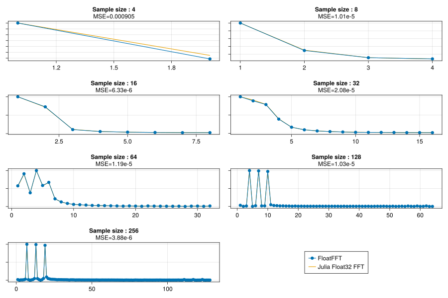

# Implementation of the FFT on Arduino

This is the companion repository for my blog post [here](http://klafyvel.me/blog/articles/fft-arduino). You'll find plenty of details there.

This directory contains several trials of implementing efficiently the Fast
Fourier Transform (FFT) on Arduino. As a comparison, I took [this implementation](https://www.instructables.com/ApproxFFT-Fastest-FFT-Function-for-Arduino/).

If you want to understand the basis of how to implement the FFT, I wrote a small
tutorial
[here](https://zestedesavoir.com/tutoriels/3939/jouons-a-implementer-une-transformee-de-fourier-rapide/)
(English version is [here](https://klafyvel.me/blog/articles/fft-julia/)).
Currently, here are the benchmarks on the following test signal, with a varying
number of points.

Below is a list of the different implementation.

## `ExactFFT`

This is a direct translation to C++ of the implementation in my tutorial.

## `ApproxFFT`

This is an implementation of the FFT by user
[abhilash_patel](https://www.instructables.com/member/abhilash_patel/) on
[Instructables](https://www.instructables.com/ApproxFFT-Fastest-FFT-Function-for-Arduino/).

It is there for comparison purpose only, as it is not very space-efficient.

## `FloatFFT`

A floating-point implementation of the FFT, using some rewriting of
multiplications in `ExactFFT`, and some bit magic to accelerate float operations.

Featuring, but not limited to :

* A table of sines to remove any call to `sin()`;
* [A bit-magic implementation of the square root](https://en.wikipedia.org/wiki/Methods_of_computing_square_roots#Approximations_that_depend_on_the_floating_point_representation);
* A homemade implementation of the square operation for floats that I detailed
  [here](https://zestedesavoir.com/billets/4153/approximer-rapidement-le-carre-dun-nombre-flottant/)
  (in French);
* Some rewritings of complex multiplications of ExactFFT using [this method](https://en.wikipedia.org/wiki/Multiplication_algorithm#Complex_number_multiplication);
 

## `Fixed16FFT`

A 16-bits fixed-point implementation of the FFT on AVR.

## `Fixed8FFT`

An 8-bits fixed-point implementation of the FFT on AVR.

